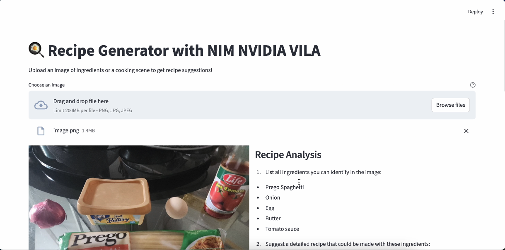
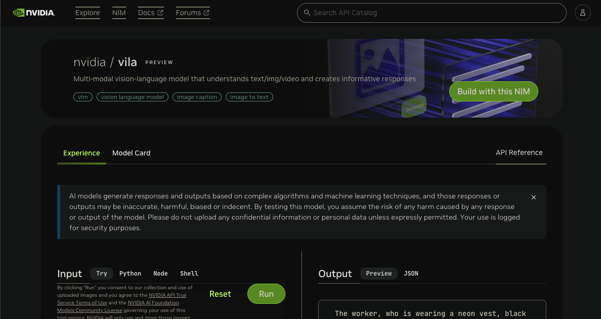

# NIM NVIDIA VILA Recipe Generator 🍳



## Overview

This project is a Streamlit-based web application that leverages [NVIDIA NIM](https://www.nvidia.com/en-us/ai/) (NVIDIA Inference Microservices) and [NVIDIA VILA](https://build.nvidia.com/nvidia/vila) (Vision Language Model) to analyze food images and generate comprehensive recipe suggestions. The application demonstrates the power of AI in understanding visual content and generating detailed, contextual recipe information.

## About [NVIDIA NIM](https://www.nvidia.com/en-us/ai/)


NVIDIA NIM is part of NVIDIA AI Enterprise, designed to streamline the development and deployment of AI-powered applications. Key features include:

- **Deploy Anywhere**: Support for cloud, data center, and GPU-accelerated workstations
- **Industry-Standard APIs**: Simple integration with just a few lines of code
- **Optimized Performance**: Best-in-class latency and throughput on NVIDIA infrastructure
- **Enterprise-Grade Support**: Comprehensive validation, security updates, and SLAs
- **Domain-Specific Solutions**: Specialized for various use cases including vision, language, and more

## About [NVIDIA VILA](https://build.nvidia.com/nvidia/vila)

NVIDIA VILA (Vision Language Model) is an advanced vision-language model optimized for:

- **Efficient Video Understanding**: Enhanced processing of video content
- **Multi-Image Analysis**: Sophisticated handling of multiple images
- **High Performance**:
  - 4.5× reduction in training costs
  - 3.4× reduction in fine-tuning memory usage
  - 1.6-2.2× faster pre-filling latency
  - 1.2-2.8× faster decoding latency
- **Superior Accuracy**: Matches or exceeds leading open and proprietary VLMs

## Features

This application demonstrates VILA's capabilities through:

1. Ingredient Recognition
2. Recipe Generation
3. Step-by-Step Instructions
4. Cultural Context
5. Recipe Variations

## Installation

```bash
# Clone the repository
git clone https://github.com/shaunliew/nim-vila-food-demo.git
cd nim-vila-food-demo

# Install required packages
pip install -r requirements.txt

# Set up environment variables
cp .env.example .env
# Add your NVIDIA API key to .env file
```

### Get NVIDIA NIM VILA KEY

visit [NVIDIA NIM VILA MODEL](https://build.nvidia.com/nvidia/vila)

press "Build with this NIM" button and generate the API Key

paste that API Key into your `.env`

## Usage

```bash
# Run the Streamlit app
streamlit run app.py
```

## Additional Resources

- [NVIDIA NIM Documentation](https://docs.nvidia.com/nim/)
- [NVIDIA API Catalog](https://build.nvidia.com/nim)
- [NVIDIA VILA GitHub Repo](https://github.com/NVlabs/VILA)
